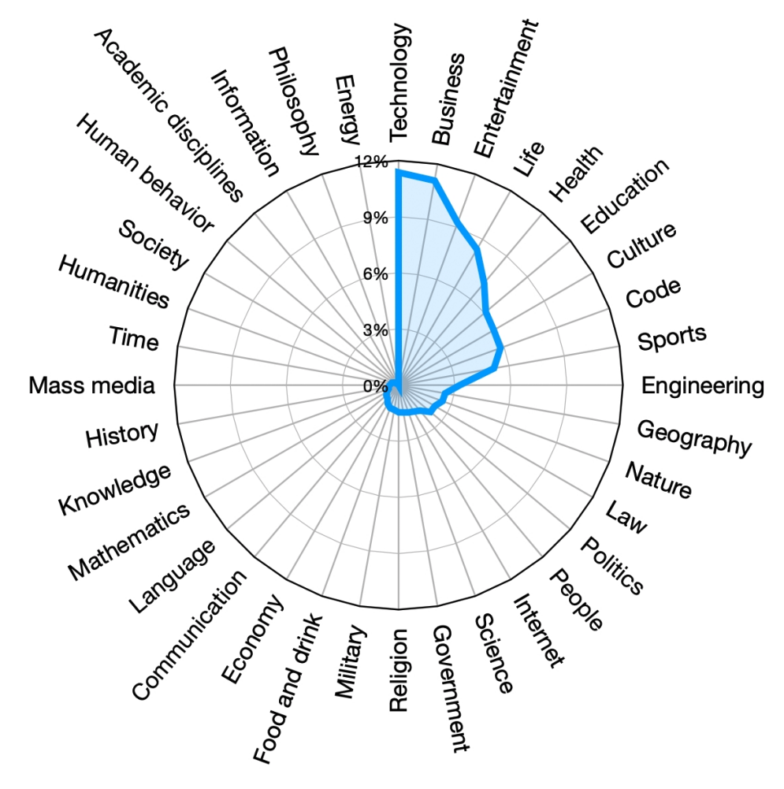

# baichuan-2

baichuan，应该是“百川”的拼音，Baichuan-2目前开放的是7B和13B两个参数规模的模型，是由百川智能开发的一个开源非商用的大规模预训练语言模型，如果商用需要联系获得单独的许可。

Baichuan-2在 baichuan 的基础上进行了优化，使用了2.6T 词元的语料训练出来，同时开放了7B、13B 两个参数规模，以及基础模型和Chat模型。

同时，Baichuan-2-7B模型还开放了中间的11个 Checkpoints 供社区研究，这在大模型开源社区中还是比较少见的，有助于科研机构探索不同训练阶段模型能力的变化。

## 基础信息

- 由百川智能开发和发布
- baichuan-2发布于2023年9月6日
- baichuan-2是基于变换器网络（Transformer）架构，7B和13B 两种参数规模
- 训练数据2.6T，同时开放训练过程的中间11个Checkpoints
- 许可：非商业定制许可证
  - 代码许可：Apache License 2.0，允许商用，相比GPL更宽松。
  - 模型许可：[baichuan-7B模型许可协议](https://huggingface.co/baichuan-inc/Baichuan2-7B-Base/resolve/main/Baichuan%202%E6%A8%A1%E5%9E%8B%E7%A4%BE%E5%8C%BA%E8%AE%B8%E5%8F%AF%E5%8D%8F%E8%AE%AE.pdf) 非商业用途可直接使用，商用的话需联系邮箱“opensource@baichuan-inc.com”以获得书面授权。
  - 模型许可协议目前仅提供中文版本。
- 支持MindSpore和昇腾硬件算力，在国产和信创方面占有优势

## 资料集合
[代码仓库：Github](https://github.com/baichuan-inc/Baichuan2)
[模型仓库：HuggingFace](https://huggingface.co/baichuan-inc)
[技术报告](https://cdn.baichuan-ai.com/paper/Baichuan2-technical-report.pdf)

## 参数

|名称|baichuan-13B|baichuan-7B|
|:-|:-|:-|
|参数规模params| 13B|7B|
|隐变量维度dimension|5120|4096|
|自注意力头的个数n heads|40|32|
|层数n layers|40|32|
|词表大小Vocab size|125696|125696|
|输入序列长度sequence length|4096|4096|
|数据规模词元数量n tokens|2.6T|2.6T|
|训练时长Training GPU-hours（A800）|||

## 模型下载

[Baichuan2-7B](https://huggingface.co/baichuan-inc/Baichuan2-7B-Base)
[Baichuan2-7B-Chat](https://huggingface.co/baichuan-inc/Baichuan2-7B-Chat)
[Baichuan2-13B](https://huggingface.co/baichuan-inc/Baichuan2-13B-Base)
[Baichuan2-13B-Chat](https://huggingface.co/baichuan-inc/Baichuan2-13B-Chat)

## 训练数据

2.6T Tokens，技术报告非常简单的提及了数据的行业分布：

略微遗憾的是，训练数据披露太过粗略。

## 算力设施

- 1024个NVIDIA A800 GPUs
