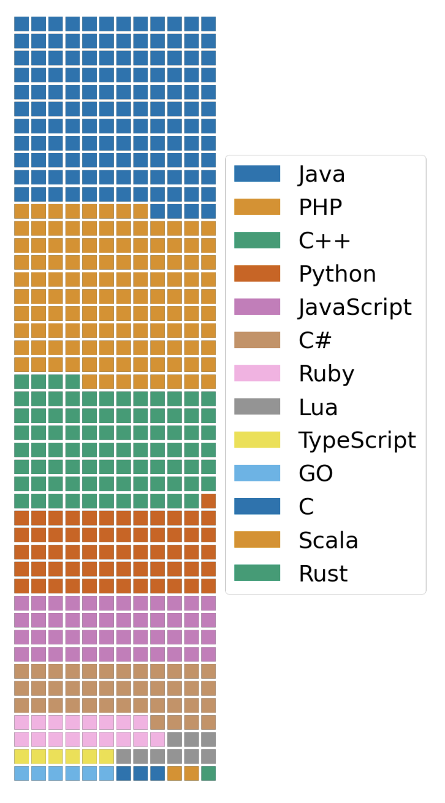

# BLOOM

BLOOM是 **B**igScience **L**arge **O**pen-science **O**pen-access **M**ul-tilingual Language Model首字母的缩写。

BigScience 不是财团（consortium），也不是正式成立的实体。这是一个由HuggingFace、GENCI和IDRIS发起的开放式协作组织，以及一个同名的研究研讨会（workshop）。其主页为 https://bigscience.huggingface.co/

BigScience发布 BLOOM，旨在为学术界、非营利组织和小型公司的研究实验室能够更好的研究和使用LLM。并且，BLOOM 本身也是由大量的是AI研究人员参与的单个研究项目，同时也是迄今为止最大规模的合作结果。

BLOOM 本身是变换器网络解码器模型，在一个称之为ROOTS的语料库上训练出来的176B参数规模【和 GPT-3一样的规模】的自回归语言模型。 BLOOM 也是第一个开源开放的超过100B的语言模型。

ROOTS语料库包含有46种自然语言和13种编程语言。

参与训练 BLOOM 的研究人员多达1000多位，来自7070 多个国家和 250 多个机构。

训练 BLOOM 的算力成本超过300万欧元，由CNRS 和 GENCI提供，训练模型的机器是法国巴黎的Jean Zay超级计算机。

## 基础信息

- 由[BigScience社区](https://bigscience.huggingface.co/)开发和发布
- 60 个国家和 250 多个机构的 1000 多名研究人员参与BLOOM的项目
- BLOOM是在2021年5月至2022年5月的一年时间里完成训练并发布的。初始版本发布于2022年5月19日。目前最新的版本是2022年7月6日发布的1.3版本。
- [arxiv的论文](https://arxiv.org/abs/2211.05100)发表时间是2022年11月9日
- BLOOM是一种基于变换器网络（Transformer）架构的自回归语言模型。该模型除了176B 之外，还提供了几个较小的模型，其模型参数规模为：560M，1.1B，1.7B，3B 和7.1B。
- 模型许可【不构成法律建议，使用时请自行解决】：[The BigScience RAIL License](https://bigscience.huggingface.co/blog/the-bigscience-rail-license) 和 [BigScience RAIL License v1.0](https://huggingface.co/spaces/bigscience/license) ：它不会对重用、分发、商业化、改编施加任何限制，只要该模型不应用于已受限制的用例（ it does not impose any restrictions on reuse, distribution, commercialization, adaptation as long as the model is not being applied towards use-cases that have been restricted.）。 大概来说，就是允许商用，但必须标明使用了BLOOM并附上同一个许可说明。

## 参数

|名称|BLOOM-176B|
|:-|:-|
|参数规模params| 176,247M（176B）|
|隐变量维度dimension|14336|
|自注意力头的个数n heads|112|
|层数n layers|70|
|词表大小Vocab size|250,680|
|输入序列长度sequence length|2048|
|数据规模词元数量n tokens|366B|
|训练时长Training GPU-hours|1,082,990（A100）|

## 训练模型的算力设施

模型在法国的[Jean Zay](http://www.idris.fr/eng/jean-zay/jean-zay-presentation-eng.html)超级计算集群上训练的。训练BLOOM的算力成本超过300万欧元，由CNRS 和 GENCI提供，训练模型的机器是法国巴黎的Jean Zay超级计算机。

训练时间3.5月，花费1,082,990计算小时。
48个节点，每个节点包括用4个NVLink互联的8块NVIDIA A100 80GB GPUs（应该是一台Nvidia DGX A100或类似的），2x AMD EPYC 7543 32-Core CPUs 和 512GB内存，一共384 A100 GPUs。 训练中预留了4个节点备用，防止训练过程的失效。节点之间使用了 4 Omni-Path 100 Gbps的交换机。

并行训练层面，使用了Megatron-DeepSpeed:
- [Megatron-LM](https://arxiv.org/abs/2201.11990)，提供了Transformer的实现、张量并行和数据加载等
- [DeepSpeed](https://github.com/microsoft/DeepSpeed)，提供了分布式训练

## 模型下载

在Hugging Face上下载

无监督预训练的模型：[BLOOM-176B](https://huggingface.co/bigscience/bloom) [BLOOM-7.1B](https://huggingface.co/bigscience/bloom-7b1)

多任务微调的模型：[BLOOMz-176B](https://huggingface.co/bigscience/bloomz) [BLOOMz-7.1B](https://huggingface.co/bigscience/bloomz-7b1)

其他参数规模的模型可在[BigScience](https://huggingface.co/bigscience)主页上查找下载

 

## 训练数据

BLOOM的训练数据是一个称为[ROOTS](https://arxiv.org/pdf/2303.03915.pdf)的语料库,一共1.61TB文本，该语料库包含了498个Hugging Face上的数据集。其包含自然语言和编程语言两部分。

ROOTS语料库包含有46种自然语言和13种编程语言。

词元（Token）数量为366B。

### 自然语言

按自然语言语言分类，占比最高的几种自然语言为：

|序号|语言|占比|说明|
|:-|:-|:-|:-|
|1|English|30.03%|英语|
|2|Simplified Chinese|16.16%|简体中文|
|3|French|12.9%|法语|
|4|Spanish|10.85%|西班牙语|
|5|Portuguese|4.91%|葡萄牙语|
|6|Arabic|4.6%|阿拉伯语|

更多的自然语言分布如下图所示：

### 编程语言

数据的选择和处理参照 DeepMind 的 [AlphaCode](https://arxiv.org/pdf/2203.07814.pdf)。数据的获取利用了Google的[BigQuery](https://cloud.google.com/blog/topics/public-datasets/github-on-bigquery-analyze-all-the-open-source-code)项目。

包含语言为Java，PHP，C++，Python，JavaScript，C#，Ruby，Lua，TypeScript，Go，C，Scala，Rust。语言的分布如下图所示：

## 模型架构

详细说明见[论文](https://arxiv.org/abs/2211.05100)

- 使用了[ALiBi Positional Embeddings](https://arxiv.org/pdf/2108.12409.pdf) 位置嵌入
- 在推断中能够完成更长序列的任务，同时 BLOOM 认为训练时更加平滑，以及对下游任务来说有更好的性能（相比跟随学习的位置编码【 Attention is all you need】和[rotary嵌入【RoFormer: Enhanced transformer with rotary position embedding】](https://arxiv.org/pdf/2104.09864.pdf)
- 在嵌入层后面加了一层 LayerNorm 层，好处是训练时提升了稳定性；坏处是会影响到推断是零样本学习的泛化能力。

